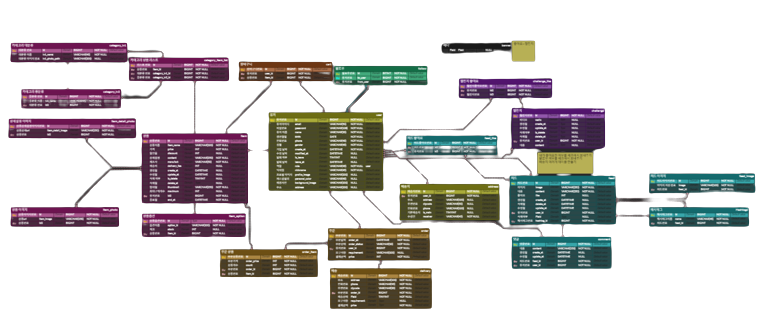
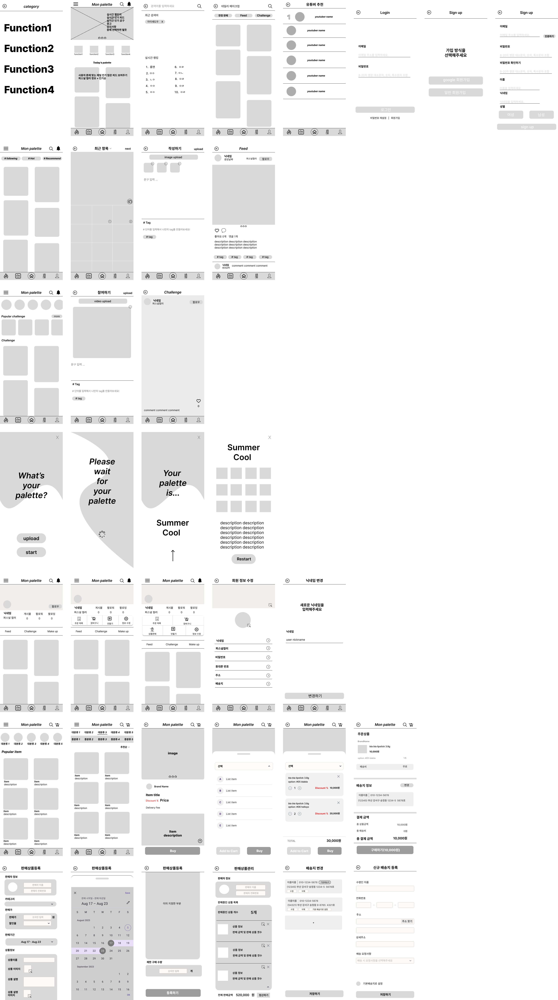
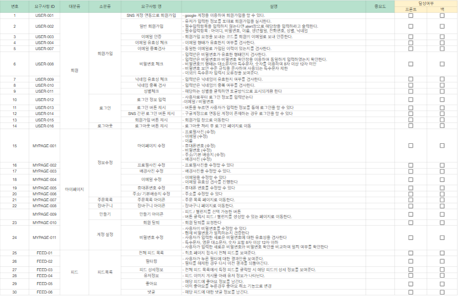
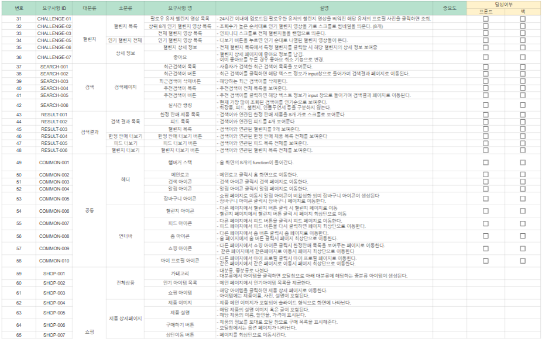
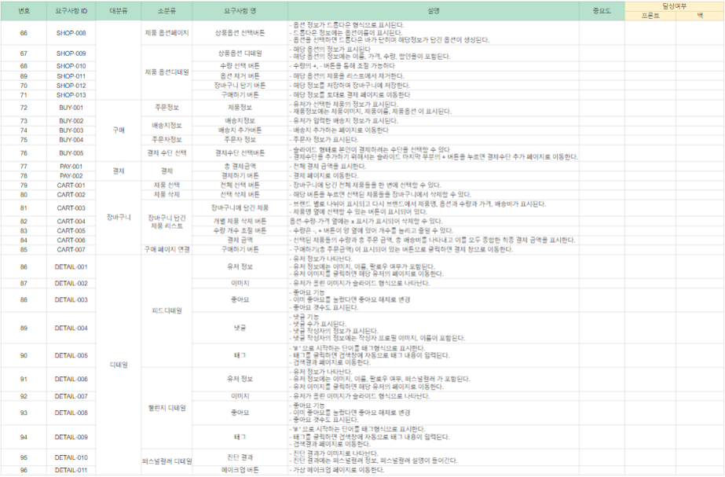
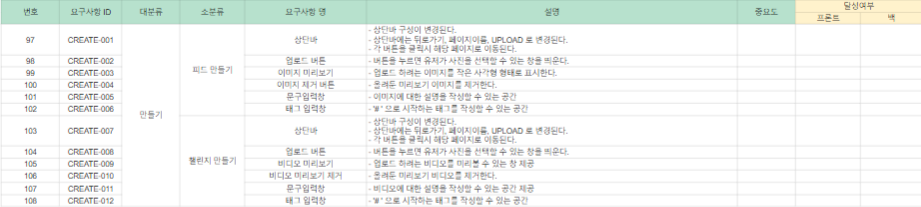
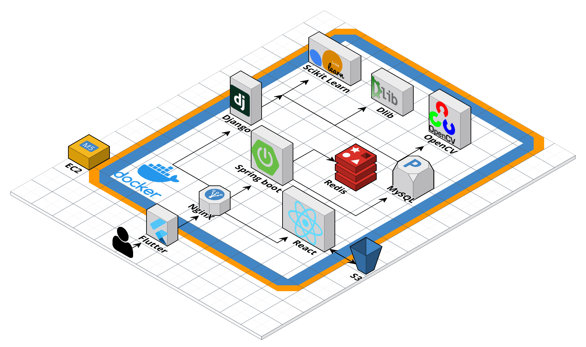

# SSAFY 9기 공통프로젝트 - 팀 양치 3분

## Description

> SSAFY 9기 2학기 1차 공통프로젝트

> 2023.07.10 ~ 2023.08.18

## About Project

### ⚒ Front Languages & Platforms

</a>
</a>
</a>
</a>
 </a>

### ⚒ Back Languages & Platforms

</a>
</a>
</a>
</a>

### ⚒ Tools

 </a>
 </a>

 </a>
 </a>
 </a>
 </a>

## System Spec

|    \*    | Specification                         |
| :------: | :------------------------------------ |
| Platform | React   Flutter                   |
|   WAS    | Spring Boot                           |
|    DB    | Mysql DB   Redis              |
|   언어   | Java  JavaScript Python           |
|   IDE    | Intellij IDEA  Visual Studio Code |
| 형상관리 | GIT   JIRA                        |

## Distributing Roles

### 👨‍💻 Front-end

- 팀장 조은정 : 회원가입, 로그인, 유저, 상품등록, 상품수정, 판매상품관리, AI 화이트 밸런스 알고리즘, 배송지 추가
- 팀원 정수완 : 퍼블리싱, api 연동, 피드, 챌린지, 네비게이션바, 라우터보안, 장바구니, 카테고리, 쇼핑몰 메인, 배송지 조회, 주문목록, 해시태그, S3, 플러터
- 팀원 김예슬 : 피드 상세페이지, 아이템 상세페이지, 퍼블리싱, UI/UX, api 연동, 퍼블리싱, 디자인, 좋아요 목록페이지, 댓글
- 팀원 오수빈 : 검색, 검색결과, 결제, 퍼스널 커러, UI/UX디자인, 퍼블리싱, api 연동

### 👨‍💻 Back-end

- 팀원 이승민 : 시큐리티, 피드, 챌린지, 댓글, 해시태그, 좋아요, 주문, 배송, 결제 통합(포트원 사용), 검색, 인기검색어, 인기 해시태그, 닉네임 자동완성, 최근 검색어, 퍼스널 컬러 진단 AI, 배포, EC2, 도커, nginx, SSL
- 팀원 최진석 : 장바구니, 쇼핑몰상품, 유저, Oauth, 팔로우/팔로잉, 카테고리, 디자인, 시큐리티

## [ER diagram](https://www.erdcloud.com/d/zsk7hbEpKZb8gpFH3)

  

    자세히
  

## [화면설계서](https://www.figma.com/file/JLUGZTIvPge3svmuXKVlbE/Untitled?type=design&node-id=0-1&mode=design&t=BUj46U8GYNMrveeI-0)

  

    자세히
  

## [요구사항정의서](https://readme.google.com/spreadsheets/d/1hAx5qhCoRiv-z2_f1oFVj8MbqUzzIZCvdEnwHWEj_UQ/edit#gid=1145252849)

  

    자세히
  

## [시스템아키텍쳐](https://app.cloudcraft.co/blueprint/ea72a24d-6513-442b-ba5e-7aee7736f3d3)

  

    자세히
  

  

## [API 정의서](https://www.notion.so/API-c5f7220e363848309c1d41426c298fbb#8f6ca5c482f84f07b0d98d9e8a660182)

  

    자세히
  

## [구현 영상]()

